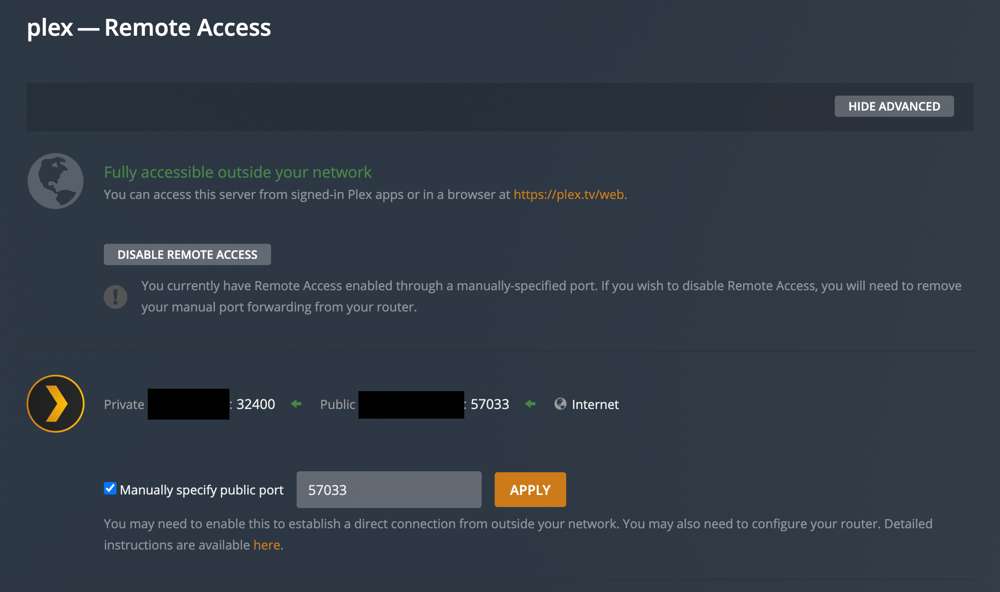
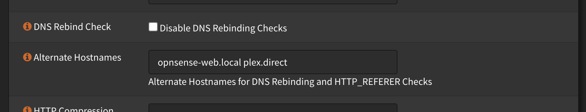
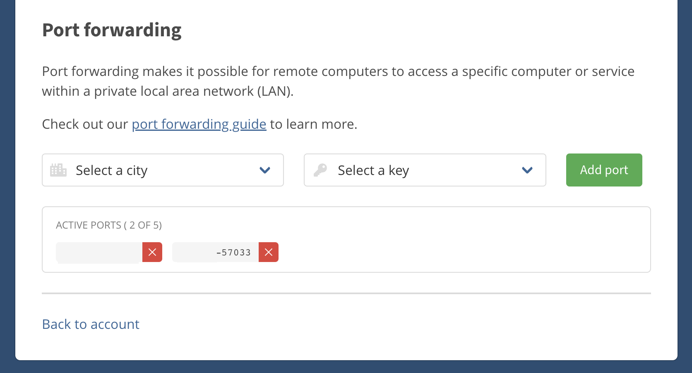
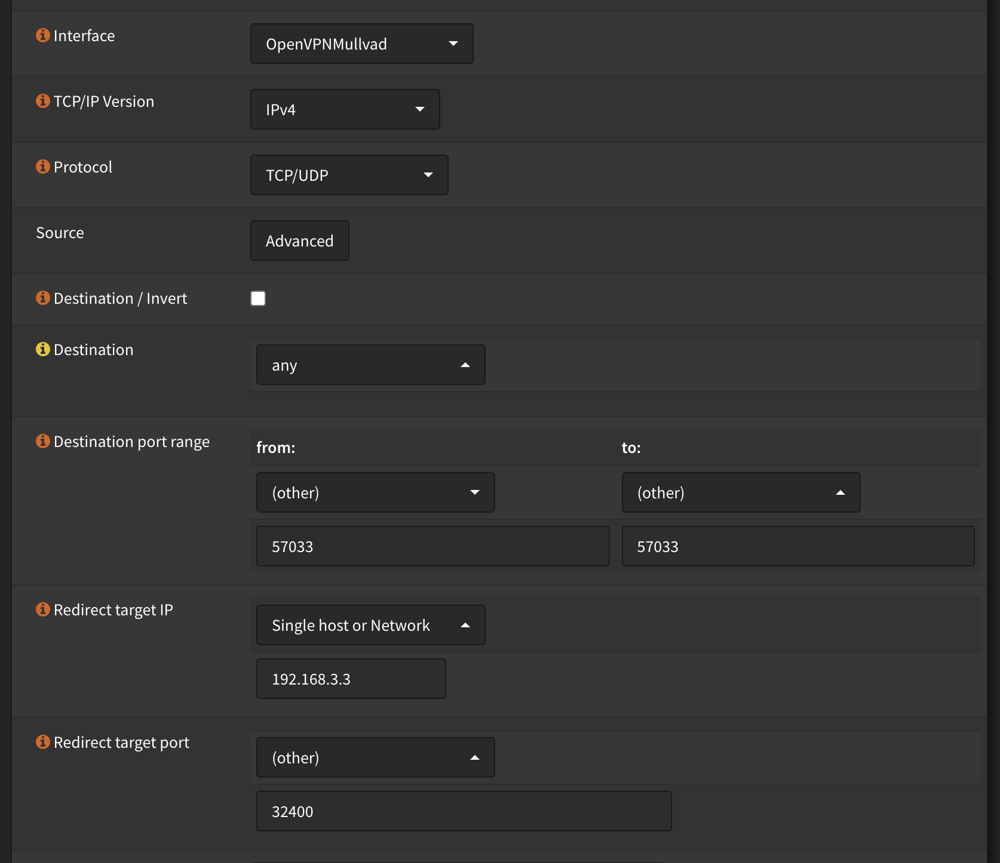
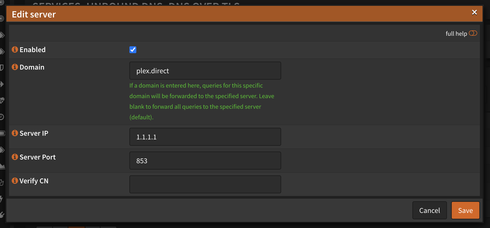
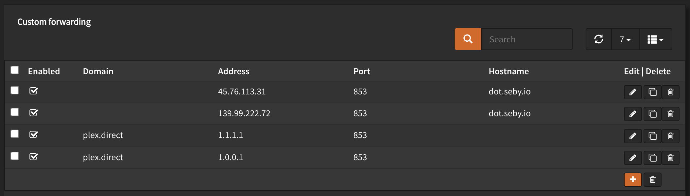

I recently ran into an issue with Plex downloading content onto my mobile devices. It would error when on my Wi-Fi network, but not when downloading over mobile data. The problem for me had to do with OPNsense, my VPN provider and DNS-over-TLS.

## The Problem

The root cause comes from [Plex using DNS rebinding](https://forums.plex.tv/t/what-is-the-reason-behind-dns-rebind-attack/547782) with its `plex.direct` domain. Plex does this to establish a secure connection with a media server. This appears in the format, `https://ip-address-goes-here.your-server.plex.direct`.

> The way it works is for the browser to make requests to a particular domain which is on a public IP address and the browser dutifully does the CORS checks to ensure that the JS code is allowed by that server to make requests. The trick is that the DNS entry for that domain has a very short TTL (Time To Live) and thus after the browser has done its CORS checks, the DNS entry is changed to be a private IP. This is the rebinding; the domain name is re-bound to a different IP address. Then subsequent requests to the same domain are pointed at the private IP instead. Then requests can be made by the JS code to that private IP address which is often used to attack an unsecured router.
>
> Routers which enable protections against the DNS rebinding attack tend to do so in the most simplistic (and wrong) way. They just assume that every single resolution to a private IP space is such an attack regardless of whether it was rebound or not.
>
> Without this, all of your clients in the LAN will be unable to make local connections to your server (unless you disable the encryption). They might be able to connect to your router’s WAN address to connect to your server (assuming that you expose your server through your router and your router supports this type of loopback).

The error message I ran into were either:

```
[Transcode] get - invalid size value: 46318922853"
```

or

```
i: [DownloadQueueManager] Download failed: 4d20d1ba6459d6cb6f31ed69ee95f5984ad81629
e: An exception occurred: java.io.IOException: Unsuccessful response: 0
e: Stacktrace: java.io.IOException: Unsuccessful response: 0
at com.plexapp.plex.mediaprovider.podcasts.offline.b.f(SourceFile:27)
at com.plexapp.plex.mediaprovider.podcasts.offline.b.e(SourceFile:1)
at com.plexapp.plex.mediaprovider.podcasts.offline.b$a.invokeSuspend(SourceFile:2)
at kotlin.coroutines.jvm.internal.a.resumeWith(SourceFile:4)
at kotlinx.coroutines.f1.run(SourceFile:22)
at kotlinx.coroutines.internal.o.run(SourceFile:2)
at kotlinx.coroutines.scheduling.k.run(SourceFile:1)
at kotlinx.coroutines.scheduling.a.l(SourceFile:1)
at kotlinx.coroutines.scheduling.a$c.d(SourceFile:4)
at kotlinx.coroutines.scheduling.a$c.n(SourceFile:4)
at kotlinx.coroutines.scheduling.a$c.run(SourceFile:1)
```

These messages have been logged several times on the Plex forums:

1. [Downloads always fail](https://forums.plex.tv/t/downloads-always-fail/787491)
2. [Downloads working on iOS, but failing on Android, although transcoding has started](https://forums.plex.tv/t/downloads-working-on-ios-but-failing-on-android-although-transcoding-has-started/784682)
3. [Unable to download to android anything ever](https://forums.plex.tv/t/unable-to-download-to-android-anything-ever/780622)
4. [Unable to download media to phone](https://forums.plex.tv/t/unable-to-download-media-to-phone/773896)

## OPNsense DNS Rebinding

Plex has [documentation about how to set up secure connections with pfSense](https://support.plex.tv/articles/206225077-how-to-use-secure-server-connections/) (the project OPNsense came from). Do this to set up a secure remote connection from outside your network. If you're using a VPN and the public IP address is from your VPN, [see the Mullvad VPN section below](#mullvad-vpn).



Afterwards, within OPNsense, under System > Settings > Administration, add `plex.direct` to the Alternative Hostnames section.



## Mullvad VPN

My network [uses Mullvad VPN for all traffic](/choosing-a-vpn-service). Within Plex, the public IP address is from my VPN provider. Therefore, to correctly secure a connection to my Plex server, a port forward has to be created from Mullvad into Plex.

From Mullvad, [create a new port forward](https://mullvad.net/en/account/#/ports) and note down the port number.



Inside OPNsense, under Firewall > NAT > Port Forward, create a new rule to allow inbound traffic from Mullvad to the Plex server.



## DNS-over-TLS

Within OPNsense's Unbound DNS integration, I also use DNS-over-TLS via [a server provided by Sebastian Schmidt](https://dns.seby.io/). From testing, I found this server wasn't properly resolving the `plex.direct` domains.

To fix this issue, I added the Cloudflare's 1.1.1.1 and 1.0.0.1 servers and configured Unbound to use them when resolving `plex.direct`.




