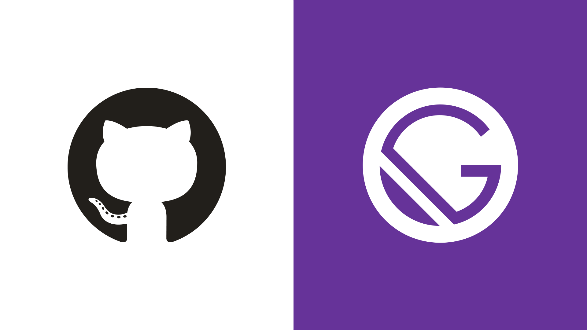

Je cherchais une bonne solution pour monter mon propre blog. Au début j'ai forcément réfléchis à des CMS classique tel que : 
- Wordpress
- Drupal
- Grav etc...

Mais je désirais aussi avoir quelque chose de simple si possible et facile d'utilisation car contenu blogging (pas de difficulté particulière). Un CMS tel que wordpress nécessite une base de donnée que j'aimerai éviter au maximum mon site n'hébergeant que des pages statiques. Si on peut éviter le PHP aussi c'est pas mal :) (toujours source de faille de sécu entre autres choses).

C'est là que j'ai découvert JAMStack (JavaScript, APIs, and (HTML) Markup). Il build le site en amont et le met à disposition sur un CDN (ou n'importe quel hoster) et en fait donc un site composé de pages statique ! Cela correspond totalement à mon besoin, on ajoute à ça quelques feature cool : 
- Pas besoin de database
- Surface d'attaque bien moins étendue, sécurité +++
- Meilleur référencement
- S’intègre super bien dans une pipeline CI/CD ou n'importe quel process d'automatisation (🤤)
- Apparemment bien plus rapide qu'un CMS traditionnel (vu que c'est des pages statiques je veux bien le croire)

Plus d'infos ici : https://jamstack.org/

Le truc c'est que JAMStack n'embarque aucune techno par défaut c'est au développeur de choisir comment l'implémenter. Je cherchais vers quel générateur JAMStack j'allais choisir, il en existe plusieurs sur le marché : 
- Next.js
- Jekyll
- Gastby

Et je suis tombé sur le post de ce [blog](https://calvin.me/now-powered-by-gatsby) qui explique pourquoi et comment il est passé de Jekyll à Gatsby et son cas d'usage correspond totalement au mien (et j'adore le design de son blog !)

J'ai donc choisi les paramètres suivants : 
- Redaction du code en local sur VS-Studio code (j'ai les plugins preview markdown etc...)
- Je push une fois fini sur un de mes projets github 
- Le push trigger un build GitHub action (workflow dans le projets) qui héberge mon blog sur GitHub Pages 

Plusieurs avantages :
- Mon blog est centralisé et versionné (une ancienne version de ce post décrivait l'ancienne façon d'héberger via GatsbyCloud héhé)
- Les utilisateurs peuvent collaborer sur les articles en soumettant un PR (dans les faits un simple edit du post sur GitHub)
- J'avais hésité à l'héberger sur l'infra maison mais vu que tout est déjà publique aucun problème à le faire héberger par un tiers
- Tout passe par un seul hebergeur --> Github

Et quelques inconvénients: 
- Je repose sur ce tiers pour le build et l'exposition de mon blog (free version 25 build/jour)
- Pas facile d'utilisation (même si sur ce cas là j'ai forké le projet de [calvin](https://github.com/calvinbui/calvin.me))

